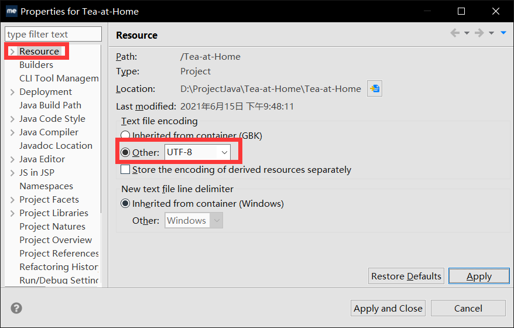

<h1 align="center">Tea at Home</h1>

大二下课设

## Overview
* demo文件夹是老师上课的工程，Tea-at-Home才是我们的工程（CV就完事了）
* picture放些截图

## Note
* 请在clone工程后，首先检查编码格式是不是UTF-8，MyEclipse默认是GBK

方法：在MyEclipse中的Workspace面板里右键Tea-at-Home项目，选择Properties，Resource，在Text file encoding下选中Other，Other的下拉菜单里选择UTF-8，最后选择apply保存

* demo下的文件都没有强制使用UTF-8，遇到乱码是正常的，请用GBK打开但是别保存

## API
### 用户注册
* 地址：`user/register`
* 请求方法：POST
* 请求格式：

|字段|类型|说明|
|--|--|--|
|username|string|注册名|
|password|string|密码|
|phone|string|电话号码|
* 响应格式：

|字段|类型|说明|
|--|--|--|
|success|boolean|是否成功注册|
|message|string|如果未成功注册会返回原因|
### 用户登录
* 地址：`user/login`
* 请求方法：POST
* 请求格式：

|字段|类型|说明|
|--|--|--|
|username|string|用户名|
|password|string|密码|
* 响应格式：

|字段|类型|说明|
|--|--|--|
|success|boolean|是否成功登录|
|message|string|如果未成功登录会返回原因|
### 用户登出
* 地址：`user/logout`
* 请求方法：GET
* 请求格式：无请求字段
* 响应格式：

|字段|类型|说明|
|--|--|--|
|success|boolean|是否成功登出|
|message|string|如果未成功登出会返回原因|
### 用户数据
* 地址：`user/query_info`
* 请求方法：GET
* 请求格式：无请求字段
* 响应格式：

|字段|类型|说明|
|--|--|--|
|success|boolean|是否成功获取用户信息|
|user|user|如果某字段为null则返回json不包含该字段|

### 添加仓库
* 地址：`depository/add`
* 请求方法：POST
* 请求格式：

|字段|类型|说明|
|--|--|--|
|name|string|仓库名|
|address|string|仓库地址|
* 响应格式：

|字段|类型|说明|
|--|--|--|
|success|boolean|是否成功添加仓库|
|message|string|如果未成功添加会返回原因|

### 修改仓库
* 地址：`depository/modify`
* 请求方法：POST
* 请求格式：

|字段|类型|说明|
|--|--|--|
|id|number|仓库id|
|name|string|新仓库名，可选|
|address|string|新仓库地址，可选|
* 响应格式：

|字段|类型|说明|
|--|--|--|
|success|boolean|是否成功修改仓库|
|message|string|如果未成功修改会返回原因|

### 模糊查询产品
* 地址：`product/fuzzy_query`
* 请求方法：POST
* 请求格式：

|字段|类型|说明|
|--|--|--|
|key|string|查询关键词|

* 响应格式：

|字段|类型|说明|
|--|--|--|
|products|array|查询结果，数组内元素类型是`Product`|

### 查询单个订单

- 地址：`buyinfo/query`

- 请求方式：POST

- 请求格式

  | 字段 | 类型 | 说明   |
  | ---- | ---- | ------ |
  | key  | int  | 订单ID |

- 响应格式： 

  | 字段 | 类型    | 说明             |
  | ---- | ------- | ---------------- |
  | bok  | Message | 是否成功获取订单 |
  | data | Buyinfo | 订单信息         |
  
  

### 查询用户的所有订单

- 地址：`buyinfo/queryall`

- 请求方式：POST

- 请求格式

  无

- 响应格式

  | 字段 | 类型    | 说明                           |
  | ---- | ------- | ------------------------------ |
  | bok  | Message | 判断查找成不成功               |
  | data | array   | array中的每一个都是BuyInfo类型 |

### 删除用户的订单

- 地址：`buyinfo/delete`

- 请求方式：POST

- 请求格式

  | 字段 | 类型 | 说明   |
  | ---- | ---- | ------ |
  | key  | int  | 订单ID |

- 响应格式

  | 字段    | 类型    | 说明         |
  | ------- | ------- | ------------ |
  | success | boolean | 是否成功删除 |
  | message | string  | 相应信息     |

  

### 更新订单

- 地址：`buyinfo/updata`

- 请求方式：POST

- 请求格式

  | 字段      | 类型   | 说明     |
  | --------- | ------ | -------- |
  | key       | int    | 订单ID   |
  | productid | int    | 产品ID   |
  | receive   | string | 收货地址 |
  | logistics | string | 物流状态 |
  | state     | int    | 订单状态 |
  | pay       | double | 付款     |

  

- 响应格式

  | 字段    | 类型    | 说明         |
  | ------- | ------- | ------------ |
  | success | boolean | 是否成功更新 |
  | message | string  | 相应信息     |

#### 删除产品

- 地址：`product/fuzzy_delete`

- 请求方式：POST

- 请求格式：

| 字段      | 类型 | 说明   |
| --------- | ---- | ------ |
| productid | int  | 产品ID |

- 响应格式：

| 字段    | 类型    | 说明     |
| ------- | ------- | -------- |
| success | boolean | 是否成功 |
| message | string  | 返回信息 |

### 增加订单

- 地址：`buyinfo/add`

- 请求方式：POST

- 请求格式

  | 字段      | 类型   | 说明   |
  | --------- | ------ | ------ |
  | productid | int    | 产品ID |
  | pay       | double | 付款   |

  

- 响应格式

  | 字段    | 类型    | 说明         |
  | ------- | ------- | ------------ |
  | success | boolean | 是否成功增加 |
  | message | string  | 相应信息     |

### 查询所有产品

- 地址：`product/fuzzy_queryall`

- 请求方式：POST

- 请求格式

  无

- 响应格式

  | 字段 | 类型    | 说明                           |
  | ---- | ------- | ------------------------------ |
  | bok  | Message | 判断查找成不成功               |
  | data | array   | array中的每一个都是product类型 |

### 增加产品

- 地址：`product/fuzzy_add`

- 请求方式：POST

- 请求格式

  | 字段         | 类型       | 说明       |
  | ------------ | ---------- | ---------- |
  | name         | string     | 产品名称   |
  | count        | int        | 产品数量   |
  | price        | BigDecimal | 价格       |
  | depositoryid | int        | 存储仓库ID |

  

- 响应格式

  | 字段 | 类型    | 说明         |
  | ---- | ------- | ------------ |
  | bok  | Message | 是否增加成功 |
  
  

### 更新产品

- 地址：`buyinfo/fuzzy_updata`

- 请求方式：POST

- 请求格式

  | 字段         | 类型   | 说明     |
  | ------------ | ------ | -------- |
  | productid    | int    | 产品ID   |
  | count        | int    | 数量     |
  | depositoryid | int    | 仓库地址 |
  | price        | double | 价格     |
  | name         | string | 产品名   |

  

- 响应格式

  | 字段    | 类型    | 说明         |
  | ------- | ------- | ------------ |
  | success | boolean | 是否成功更新 |
  | message | string  | 相应信息     |

#### 选择多个购物车进行购买

- 地址：`buy/shoppingcar`

- 请求方式:：POST

  | 字段 | 类型  | 说明                             |
  | ---- | ----- | -------------------------------- |
  | data | array | 里面的每一个都是Shoppingcart类型 |

- 响应格式

  | 字段    | 类型    | 说明     |
  | ------- | ------- | -------- |
  | success | boolean | 是否成功 |
  | message | string  | 返回信息 |

#### 增加购物车

- 地址：`shoppingcar/add`

- 请求方式：POST

- 请求格式

  | 字段      | 类型 | 说明       |
  | --------- | ---- | ---------- |
  | productid | int  | 产品的ID   |
  | count     | int  | 产品的数量 |

- 响应格式

  | 字段 | 类型         | 说明           |
  | ---- | ------------ | -------------- |
  | bok  | Message      | 是否成功       |
  | data | ShoppingCart | 一个购物车信息 |

#### 删除购物车

  - 地址：`shoppingcar/delete`

  - 请求方式：POST

  - 请求格式

    | 字段          | 类型 | 说明     |
    | ------------- | ---- | -------- |
    | shoppingcarid | int  | 产品的ID |

    

  - 响应格式

    | 字段    | 类型    | 说明     |
    | ------- | ------- | -------- |
    | success | boolean | 是否成功 |
    | message | string  | 返回信息 |

#### 查询用户的所有购物车

- 地址：`shoppingcar/queryall`

- 请求方式：POST

- 请求格式：无

- 响应格式：

  | 字段 | 类型    | 说明                      |
  | ---- | ------- | ------------------------- |
  | bok  | Message | 是否成功                  |
  | data | array   | 每一个元素都是shoppingcar |

#### 查询用户的某个购物车

- 地址：`shoppingcar/queryall`

- 请求方式：POST

- 请求格式：

  | 字段          | 类型 | 说明       |
  | ------------- | ---- | ---------- |
  | shoppingcarid | int  | 购物车的ID |

  

- 响应格式：

  | 字段 | 类型          | 说明       |
  | ---- | ------------- | ---------- |
  | bok  | Message       | 是否成功   |
  | data | Shoppingcarid | 购物车信息 |

  

#### 查询所有产品

- 地址：`product/fuzzy_queryall`

- 请求方式：POST

- 请求格式：无

- 响应格式：

  | 字段 | 类型    | 说明                  |
  | ---- | ------- | --------------------- |
  | bok  | Message | 是否成功              |
  | data | array   | 每一个元素都是product |

#### 在产品页面进行购买

- 地址：`buy/product`

- 请求方式:：POST

  | 字段      | 类型 | 说明     |
  | --------- | ---- | -------- |
  | productid | int  | 产品ID   |
  | count     | int  | 购买数量 |

- 响应格式

  | 字段 | 类型    | 说明     |
  | ---- | ------- | -------- |
  | bok  | Message | 是否成功 |
  | data | BuyInfo | 订单信息 |

## Session

### Attribute
* `user`：包含当前已登录用户信息
  * 调用`user/login`如果成功，会将`User`实例存入Attribute
  * 调用`user/logout`会将`Session`销毁，无论用户是否登陆过

## QA
* Q：为啥不用maven、gradle？
* A：别问，问就是不会配环境

* Q：为啥要用eclipse？
* A：又不是不能用（不过我自己用的idea）

## TODO
* 产品介绍？